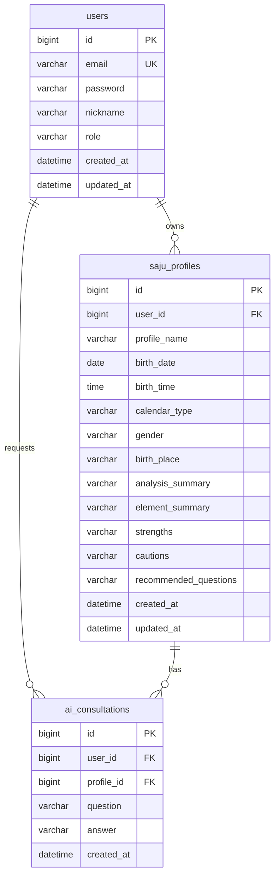

# ERD

```mermaid
erDiagram
    users ||--o{ saju_profiles : owns
    users ||--o{ ai_consultations : requests
    saju_profiles ||--o{ ai_consultations : has

    users {
        bigint id PK
        varchar email UK
        varchar password
        varchar nickname
        varchar role
        datetime created_at
        datetime updated_at
    }

    saju_profiles {
        bigint id PK
        bigint user_id FK
        varchar profile_name
        date birth_date
        time birth_time
        varchar calendar_type
        varchar gender
        varchar birth_place
        varchar analysis_summary
        varchar element_summary
        varchar strengths
        varchar cautions
        varchar recommended_questions
        datetime created_at
        datetime updated_at
    }

    ai_consultations {
        bigint id PK
        bigint user_id FK
        bigint profile_id FK
        varchar question
        varchar answer
        datetime created_at
    }
```

## 관계 설명

- `User 1 : N SajuProfile`
- `User 1 : N AiConsultation`
- `SajuProfile 1 : N AiConsultation`
- 상담 조회와 생성은 항상 `user_id`와 `profile_id`를 함께 검증합니다.
